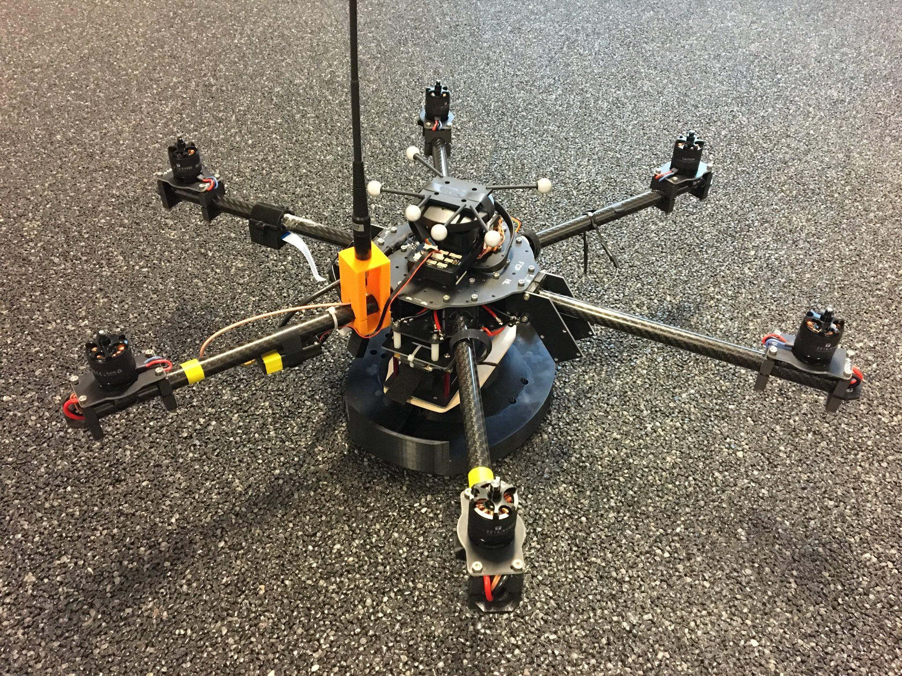
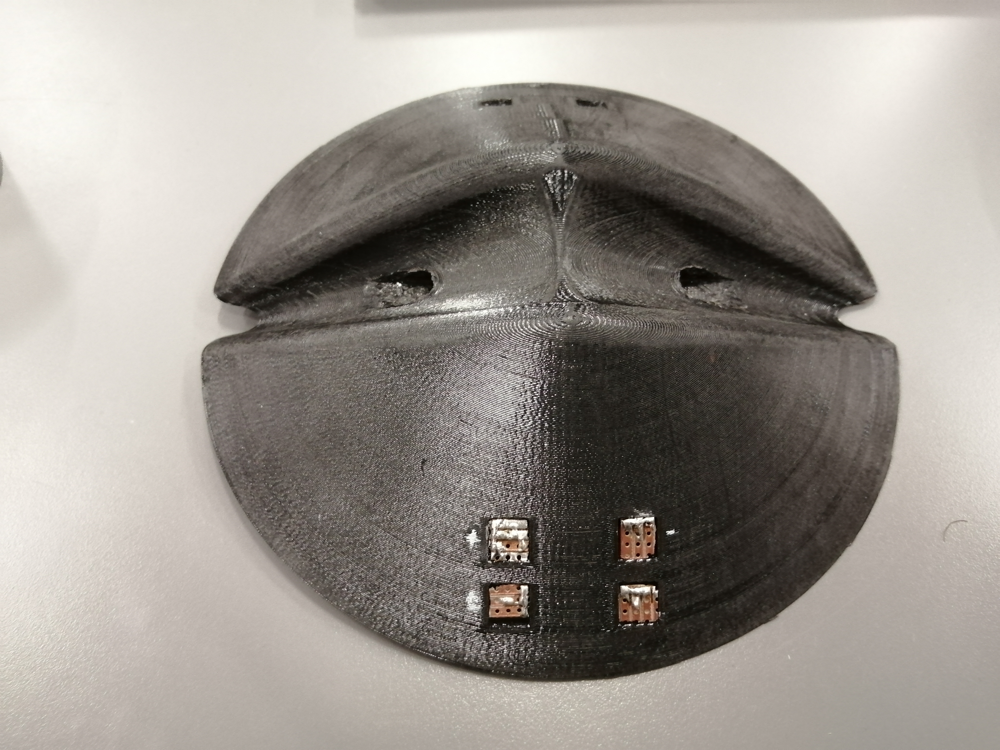
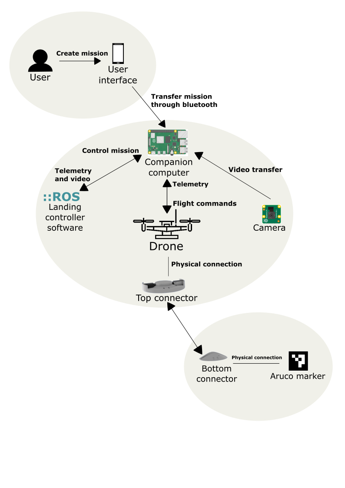

# EIT-DAS
This project deliberates on the design and implementation of a drone-based
Quick Connector (QC) system. A visual approach for the precise landing on the connector is used and all the computations are performed on board on a Raspberry Pi 3B+. All
additional parts including the newly designed connector are 3D printed.
Experiments were conducted in simulation in the real world with partial
success. The reliability of the system was lower than expected, but a
proof of concept implementation of a Global Positioning System (GPS)
guided drone is shown, which autonomously attaches and detaches on
the developed connector system with an attached marker used for visual
guidance. This repository contains the software implementation of the project. The drone can be simulated in gazebo. 
A video from the indoor test, for which we used OptiTrack is [here](https://youtu.be/hyc7kXy4a8c), a video from the simulation [here](https://youtu.be/xp5y24glsds)

To connect the drone, we developed following quick connector system, which attaches passively with the weight of the drone and can be detached programmatically. For the detach process we used solenoids.

Drone platform with attached Quick Connector             |  Bottom part of Quick Connector
:-------------------------:|:-------------------------:
  |   

A high level of the sysstem design, as well as the landing sequence are visulaized in following:
System design             |  Landing sequence
:-------------------------:|:-------------------------:
  |  
# Getting started
Build and run the docker container with `docker-compose -f simulation-docker-compose.yml build && docker-compose -f simulation-docker-compose.yml run gazebo bash`

Run following commands inside the docker-container to start the simulation:
## Launch
Px4 SITL simulation environment, keep in mind to run seit-ws in advanced 
- l_eitpg or headless with lh_eigpg
    - `seit-ws && roslaunch eit_playground posix.launch vehicle:=sdu_drone_mono_cam_downward env:=demo`, vehicle is optional
- l_mavros
    - `seit-ws && roslaunch mavros px4.launch fcu_url:="udp://:14540@127.0.0.1:14557"`
- l_offbnode
    - `seit-ws && roslaunch eit_playground eit.launch`

### Troubleshooting
- If you run Gazebo inside docker, make sure to expose the xhost, run `xhost +` in any terminal on your host machine
- If you run Gazebo in headless mode, link the models inside eit_playground to your local gazebo models file
